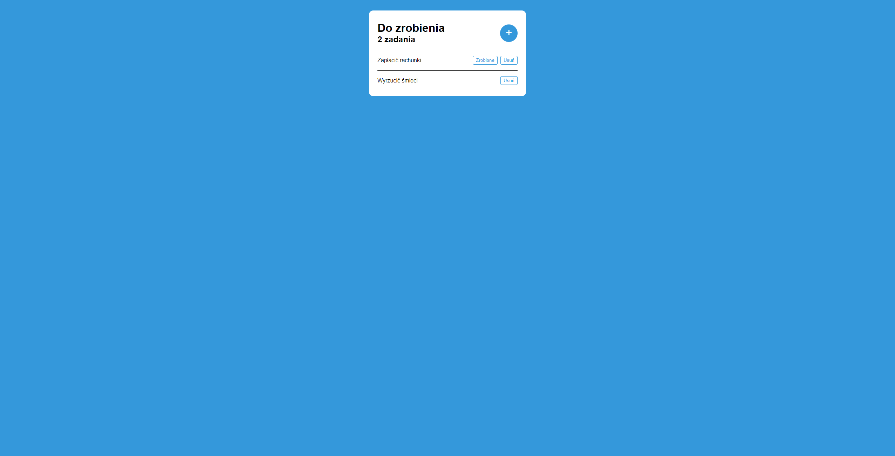

# 📝 Todo App



**A simple, efficient to-do list application built with React and Vite. This project allows users to manage daily tasks with ease, offering an intuitive interface for adding, marking, and removing tasks.**

## Project Overview

The Todo App is a lightweight application that helps users keep track of their tasks. Developed with React, this project explores the fundamentals of component-based design and state management, specifically utilizing `useReducer` for streamlined state handling.

### Key Features

- **Add Tasks**: Enter a task description to add a new task to the list.
- **Mark as Done**: Click the “Done” button to mark a task as completed, which applies a strikethrough style for easy identification.
- **Delete Tasks**: Remove tasks from the list with a single click.
- **Dynamic Form Display**: Shows and hides the form for adding tasks based on user actions.
- **Responsive Design**: The application is fully responsive, ensuring a seamless experience on various devices.

### Technologies Used

- **React**: Provides the structure for the application, with a focus on component-based architecture.
- **Vite**: A modern frontend build tool for quick and efficient development.
- **CSS Modules**: Enables scoped and modular styles, maintaining a clean and organized codebase.
- **JavaScript (useReducer)**: Manages the application state in a scalable and predictable manner.

## How It Works

1. **Initial State**: The app starts with a predefined list of tasks, each containing a name, status, and unique ID.
2. **Adding Tasks**: The user can click the **+** button to open the form and add a new task, which will appear on the list.
3. **Marking Tasks as Done**: When a task is marked as done, it is visually updated to reflect its completed status.
4. **Deleting Tasks**: Users can delete tasks to keep the list focused on what’s most important.

## Project Structure

```
src/
├── components/
│   ├── button/         # Reusable Button component
│   ├── form/           # Form component for adding new tasks
│   └── todoItem/       # Component representing each task item
├── reducer/
│   └── appReducer.js   # Reducer handling the application state and actions
├── utils/
│   └── getSubheading.js # Utility function for generating a dynamic subheading
├── App.jsx             # Main application component
└── index.js            # Application entry point
```

## Local Setup

To run the Todo App locally on your machine, follow these steps:

1. Clone this repository to your local machine:
```
   git clone https://github.com/NartiOfficial/TodoList.git
```
  
2. Navigate to the project folder:
```
  cd todo-app
```

3. Install the dependencies:
```
npm install
```

4. Run the development server:
```
npm run dev
```

## Contributing
Contributions are welcome! Feel free to fork this repository, make enhancements, and submit a pull request. Whether it's a new feature, bug fix, or optimization, your input is valuable.

---

Happy coding! 🚀
